# MEV Forensics Agent

> An autonomous investigator that tells MEV searchers why their trades underperformed — and proves it.

Built for **ETHGlobal OpenAgents 2026**.

---

## The problem

DEX trading bots running arbitrage, liquidation, or sandwich strategies submit thousands of transactions every day. Some win. Many underperform. When they do, finding out why means manually cross-referencing Etherscan, a block explorer, Tenderly, and a spreadsheet — **15–30 minutes per trade**, most of which never get investigated at all.

MEV Forensics Agent automates that entire workflow. Point it at a transaction hash, ask *"why did this tx earned less than I expected?"*, and watch it work.

---

## What it does

The agent investigates a single historical trade end-to-end:

1. **Loads the transaction** — block position, logs, realized PnL
2. **Simulates expected PnL** — re-executes the tx against pre-block chain state via Tenderly, as if no other tx had touched the pool
3. **Measures the gap** — compares expected vs realized using a dual threshold (>5% *and* >$10 USD)
4. **Hunts for a cause** — scans the same block for competing transactions that touched the same pool at a lower index
5. **Confirms or rules out** — if a competitor is found, traces it to confirm pool contact; if not, reads pool state across the block boundary to check for organic price movement
6. **Delivers a cited report** — every claim is backed by a specific tool result; nothing is inferred from general knowledge

If it can't confidently classify the trade, it says so — and shows the full audit trail of what it ruled out. That admission of uncertainty, with receipts, is a feature.

---

## Investigation flows

```
get_trade → simulate_at_state(N-1)
                    │
            gap > threshold?
           /                 \
          NO                 YES
          │                   │
  A2 → B9                get_block_txs
  (normal variance,              │
   stop here)           competitor found?
                        /               \
                      YES               NO
                       │                │
               get_tx_trace        get_pool_state(N-1, N)
                       │                │
                  A2 → B1          A2 → B9
               (frontrun         (stale quote or
               confirmed)         genuinely unknown)
```

| Result | Meaning |
|---|---|
| `A2 → B1` | Trade succeeded but a competing tx at a lower block index consumed the liquidity first |
| `A2 → B9` (fast) | Gap is within normal variance — not worth investigating |
| `A2 → B9` (full) | Investigated everything, no cause found — full audit trail provided |

---

## Architecture!!



<!-- ```
           ┌─────────────────────────────┐
           │        apps/web             │
           │  Next.js · chat interface   │
           │  tool-call timeline · SSE   │
           └──────────────┬──────────────┘
                          │ HTTP / SSE
                          ▼
           ┌─────────────────────────────┐
           │        apps/api             │
           │  Hono · GET /trades         │
           │  POST /investigate (SSE)    │
           │  POST /webhook/tenderly     │
           └──────────────┬──────────────┘
                          │
                          ▼
           ┌─────────────────────────────┐
           │     packages/agent          │
           │  Investigation flows        │
           │  System prompt · taxonomy   │
           │  Citation verification      │
           └──┬──────────┬──────────┬───┘
              │          │          │
              ▼          ▼          ▼
   ┌──────────────┐ ┌──────────┐ ┌──────────────┐
   │packages/     │ │packages/ │ │packages/     │
   │claude        │ │tenderly  │ │rpc           │
   │              │ │          │ │              │
   │Tool-use loop │ │simulate  │ │viem · blocks │
   │SSE emission  │ │trace     │ │getLogs · ABI │
   │Budget cap    │ │cache     │ │              │
   └──────────────┘ └──────┬───┘ └──────┬───────┘
                           │            │
                           └─────┬──────┘
                                 ▼
                    ┌────────────────────────┐
                    │   packages/pool-math   │
                    │  Uni v2/v3 PnL math    │
                    │  @uniswap/v3-sdk       │
                    └────────────────────────┘
``` -->

**Webhook automation (KeeperHub):** Running a Tenderly simulation fires a webhook → KeeperHub guarantees delivery to `POST /webhook/tenderly` → investigation starts automatically. No manual tx hash pasting required.

---

## Monorepo structure

```
agentic-mev-forensics/
├── apps/
│   ├── api/              # Hono server, SSE streaming, webhook handler
│   └── web/              # Next.js dashboard
└── packages/
    ├── shared/           # TypeScript types shared across all packages
    ├── claude/           # Claude API client — tool-use loop, streaming, budget enforcement
    ├── agent/            # MEV investigation logic — prompts, flows, citation verification
    ├── tenderly/         # Tenderly REST wrapper — simulate, trace, in-memory cache
    ├── rpc/              # viem wrapper — blocks, transactions, Swap event filtering
    ├── pool-math/        # Uniswap v2/v3 expected PnL using @uniswap/v3-sdk
    └── keeperhub/        # KeeperHub webhook client for automated investigation triggers
```

---

## Tech stack

| Layer | Choice |
|---|---|
| Language | TypeScript |
| Monorepo | pnpm workspaces + Turborepo |
| Ethereum RPC | viem + Tenderly Node (or Alchemy) |
| Simulations & traces | Tenderly REST API |
| LLM | Claude (`claude-sonnet-4-6`) via `@anthropic-ai/sdk` |
| Uniswap math | `@uniswap/v3-sdk` + `@uniswap/sdk-core` |
| API server | Hono |
| Streaming | Server-Sent Events (SSE) |
| Frontend | Next.js + TailwindCSS |
| Webhook automation | KeeperHub |
| Storage | JSON files on disk (hackathon scope) |

---

## Key design decisions

**`packages/claude` vs `packages/agent` are separate.** `packages/claude` is a generic Claude tool-use client — it knows nothing about MEV. `packages/agent` is the MEV brain that uses it. This means the loop mechanics (budget enforcement, SSE emission, tool dispatch) are reusable; the investigation logic is not tangled with them.

**`unknown` is a first-class answer.** When the agent investigates and finds nothing, it produces a full audit trail of every hypothesis it ruled out. This is intentional — an agent that admits uncertainty with evidence is more trustworthy than one that always returns a confident answer.

**Evidence discipline is enforced in code.** The system prompt prohibits general-knowledge reasoning. A post-processing step strips any uncited claim before the narrative reaches the UI. If a tool returned nothing, the agent says so.

**Tool budget is enforced in the loop, not the prompt.** At 8 tool calls the loop injects a hard stop message regardless of what the agent wants to do next. Prompts can be argued with; code cannot.

**Tenderly simulation is the critical path.** `simulate_at_state` replays the tx against historical chain state at block `N-1` — this is what produces the "expected PnL" ground truth. An off-by-one on block semantics breaks the entire demo. Validate this on day 2 against a known clean trade before building anything else.

---

## Scope (hackathon MVP)

**In scope**
- Single chain: Ethereum mainnet
- DEX coverage: Uniswap v2 + v3 only
- Read-only analysis of historical trades
- 2 curated demo trades from real MEV wallets
- Multi-turn conversational interface
- 2 investigation paths: `A2 → B1` (frontrun confirmed) and `A2 → B9` (unknown)

**Explicitly out of scope**
- Live trade execution or wallet key handling
- Multi-chain, Curve, Balancer, or any AMM beyond Uni v2/v3
- Real-time alerting or aggregate dashboards
- Auth, multi-user, production infrastructure